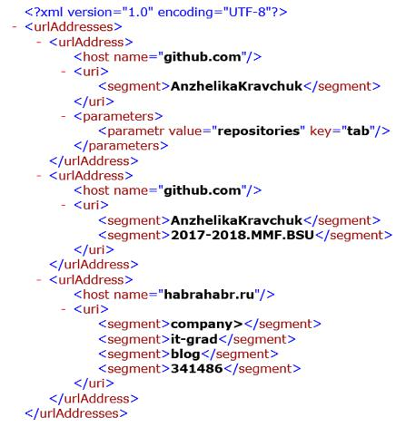
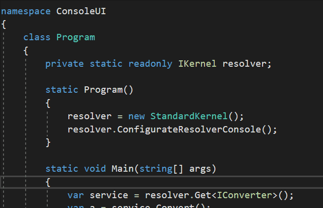

## Задачи
:heavy_check_mark: В текстовом файле построчно хранится информация об URL-адресах, представленных в виде:
```
<scheme>://<host>/<URL-path>?<parameters>

```
где сегмент *parameters* - это набор пар вида *key=value*, при этом сегменты URL‐path и parameters или сегмент parameters могут отсутствовать. 

Разработать (в соответствии в принципами SOLID) систему типов для экспорта данных, полученных на основе разбора информации текстового файла в XML-документ по следующему правилу, например, для текстового файла с URL-адресами

* https://github.com/AnzhelikaKravchuk?tab=repositories
* https://github.com/AnzhelikaKravchuk/2017-2018.MMF.BSU
* https://habrahabr.ru/company/it-grad/blog/341486/

результирующим является XML-документ вида (можно использовать любую XML технологию без ограничений):



Для тех URL-адресов, которые не совпадают с указанным паттерном, залогировать информацию (предусмотреть возможность замены лог-фреймворка, в качестве дефолтного использовать NLog), отметив указанные строки, как необработанные. Для работы с URL можно использовать Uri Class.

Продемонстрировать работу на примере консольного приложения.

При реализации solution-а для организации проектов использовать Stairway-паттерн.

Для разрешения зависимостей использовать Ninject.

Для тетирования основой функциональности использовать NUnit и Moq фреймворки.

При реализации системы типов учитывать возможность их использования в случае, когда в исходном текстовом файле информация об URL-адресах изменится на другую, иерархически представимую информацию.

